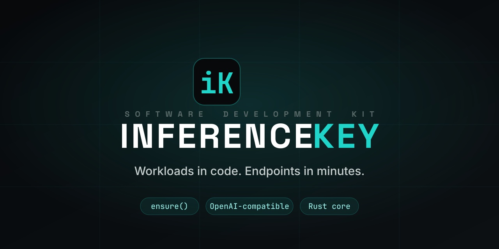
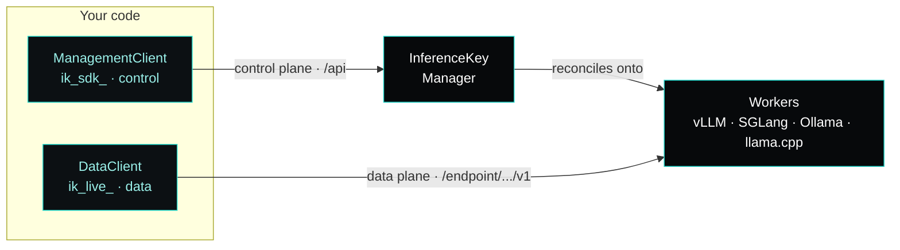

<!-- README for inferencekey/inferencekey-sdk. Kept in manual sync with the docs
     site (docs/ → docs.inferencekey.com) and the product landing (crates/landing).
     Each section deep-links to its canonical docs page so the two never drift. -->

<p align="center">
  <a href="https://docs.inferencekey.com">
    
  </a>
</p>

<h1 align="center">InferenceKey SDK</h1>

<p align="center">
  <strong>Workloads in code. Endpoints in minutes.</strong><br>
  Declare an AI workload, call <code>ensure()</code>, and get back an
  OpenAI-compatible endpoint you can hit right away.<br>
  One Rust core. Native Python &amp; TypeScript packages.
</p>

<p align="center">
  <a href="https://docs.inferencekey.com"></a>
  <a href="https://cloud.inferencekey.com"></a>
  <a href="./LICENSE"></a>
</p>

<p align="center">
  
  
  
  
</p>

> **Status: early development.** A single Rust **core** plus a stable **C ABI** and
> thin **native bindings** per language. Python and TypeScript ship first; Go and
> Java follow over the same C ABI. The published packages (`inferencekey` on PyPI,
> `@inferencekey/sdk` on npm) are not out yet — today you build from this repo.

---

## What is this?

[InferenceKey](https://inferencekey.com) is an AI infrastructure platform: run
every model, project and workload from one place, keep spend under control, and
scale on demand. **This repo is the SDK** — an _optional_ way to drive the
platform **from code** instead of the dashboard.

```python
ref = mgmt.ensure(WorkloadSpec(name="support-bot", slug="support-bot",
    model="meta-llama/Llama-3.1-8B-Instruct", backend=Backend.VLLM,
    command="vllm serve meta-llama/Llama-3.1-8B-Instruct --max-model-len 8192"))

out = data.endpoint(ref.workload_slug, api_key="ik_live_...").generate_text(prompt="Hi")
print(out.text)
```

You **declare** a workload, the SDK **ensures** it exists on the platform, and you
**call** the resulting OpenAI-compatible endpoint. That's the whole loop.

> The SDK is an add-on — the platform works fully from the dashboard without it.

## Why InferenceKey

The SDK is a thin door onto a platform built for teams scaling AI — not fighting
infra. Behind the `ensure()` call:

| | Capability | What it gives you |
| :--: | --- | --- |
| 💸 | **Spend control** | Know exactly where your AI spend goes — per machine, project, model and team. Budgets and alerts, no surprises at the end of the month. |
| 📈 | **Scale on demand** | Scale AI without rebuilding your stack. Demanding workloads — text & audio streaming, image analysis, content generation, knowledge-grounded apps — served in real time. |
| 🔌 | **Swap engines, one URL** | Run **vLLM, SGLang, Ollama or llama.cpp** behind a single endpoint. Swap the engine as you scale; the URL your code calls never changes. |
| ⚙️ | **Smart rules** | Run compute only when it makes sense — start machines when there's work, stop them when there's none. Fixed, scheduled or autoscaling, per workload. |

And for the SDK itself:

- **OpenAI-compatible** — workloads expose the OpenAI chat/embeddings API. Point existing code at them, no new client to learn.
- **Open source** — Apache-2.0. One audited Rust core, native packages — read it, vendor it, trust it.
- **Secure by design** — two tokens, least privilege: a leaked inference key can never reconfigure your infrastructure.

## How it fits together

You **declare** with the control plane (`ManagementClient`, an `ik_sdk_` token)
and **call** with the data plane (`DataClient`, an `ik_live_` token). The two
planes never share a path, a client, or a token.



`ensure()` is idempotent on the **slug**, so you can run it on every deploy and it
converges instead of duplicating. → [Architecture](https://docs.inferencekey.com/en/reference/architecture/)

## Two tokens, least privilege

The code that *creates* workloads is never the code that *calls* them — enforced
server-side, and again client-side with fast, typed wrong-token errors.

| Token | Plane | Client | Scope | Inference? | Provision? |
| --- | --- | --- | --- | :--: | :--: |
| `ik_sdk_…` | Control | `ManagementClient` | One project | ❌ | ✅ |
| `ik_live_…` | Data | `DataClient` endpoints | Per workload | ✅ | ❌ |

A data key is passed **per workload**, so one app can drive many workloads, each
with its own key — a leaked key blasts only a single workload's radius.
→ [Tokens](https://docs.inferencekey.com/en/reference/tokens/)

## First result in under 5 minutes

**1 · Get two tokens** in the [dashboard](https://cloud.inferencekey.com): a
control token (`ik_sdk_`) and a data token (`ik_live_`). → [Tokens quickstart](https://docs.inferencekey.com/en/quickstart/tokens/)

**2 · Set your environment:**

```bash
export INFERENCEKEY_BASE_URL="https://api.inferencekey.com"
export INFERENCEKEY_PROJECT="acme"
export INFERENCEKEY_SDK_TOKEN="ik_sdk_..."   # control plane
export INFERENCEKEY_API_KEY="ik_live_..."    # data plane (default)
```

**3 · Ensure the workload, then call it:**

<details open>
<summary><b>Python</b></summary>

```python
from inferencekey import ManagementClient, DataClient, WorkloadSpec, Backend

# Control plane: provision/reconcile the workload (ik_sdk_ token).
mgmt = ManagementClient.from_env(project="acme")
ref = mgmt.ensure(WorkloadSpec(
    name="support-bot",
    slug="support-bot",
    model="meta-llama/Llama-3.1-8B-Instruct",
    backend=Backend.VLLM,
    command="vllm serve meta-llama/Llama-3.1-8B-Instruct --max-model-len 8192",
))  # on_drift defaults to RECONCILE

# Data plane: call the resulting OpenAI-compatible endpoint (ik_live_ token).
data = DataClient.from_env(project="acme")
ep = data.endpoint(ref.workload_slug, api_key="ik_live_...")
out = ep.generate_text(prompt="Hola", temperature=0.2, max_tokens=300)

print(out.text)   # generated text
print(out.model)  # model that served the request
```

</details>

<details>
<summary><b>TypeScript</b></summary>

```typescript
import { ManagementClient, DataClient, Backend } from "@inferencekey/sdk";

// Control plane: provision/reconcile the workload (ik_sdk_ token).
const mgmt = ManagementClient.fromEnv({ project: "acme" });
const ref = await mgmt.ensure({
  name: "support-bot",
  slug: "support-bot",
  model: "meta-llama/Llama-3.1-8B-Instruct",
  backend: Backend.Vllm,
  command: "vllm serve meta-llama/Llama-3.1-8B-Instruct --max-model-len 8192",
});

// Data plane: call the resulting OpenAI-compatible endpoint (ik_live_ token).
const data = DataClient.fromEnv({ project: "acme" });
const ep = data.endpoint(ref.workloadSlug, { apiKey: process.env.SUPPORT_IK_LIVE });
const out = await ep.generateText({ prompt: "Hola", temperature: 0.2, maxTokens: 300 });

console.log(out.text); // generated text
```

</details>

→ Full walkthrough: [Quickstart](https://docs.inferencekey.com/en/quickstart/tokens/) ·
runnable code in [`examples/`](./examples/)

## Backends

Pick the serving engine with the `backend` field. The platform handles placement —
a `WorkloadSpec` has no `provider` and no `min_vram_gb`.

| `Backend` | Wire | When to use |
| --- | --- | --- |
| `OLLAMA` / `Ollama` | `ollama` | Quick local-style serving and broad GGUF coverage. Simplest to stand up. |
| `VLLM` / `Vllm` | `vllm` | High-throughput production text generation. You control the launch command. |
| `VLLM_OMNI` / `VllmOmni` | `vllm-omni` | vLLM for multimodal / omni models. Same command-driven config. |
| `SGLANG` / `Sglang` | `sglang` | Structured / programmatic generation on the SGLang runtime. |
| `LLAMACPP` / `Llamacpp` | `llamacpp` | Prebuilt `llama-server` for **GGUF** models. Strong on AMD/ROCm and Apple Silicon. |

`task_type` defaults to `text2text` and spans **12 modalities** (text, embeddings,
images, audio, reranking, classification, reward, …); `execution_policy` is
`fixed`, `scheduled` or `autoscaling`.
→ [Backends & policies](https://docs.inferencekey.com/en/reference/backends-and-policies/)

## Examples

Runnable, self-contained examples live in [`examples/`](./examples/) — each one is
a folder you copy, set a few env vars, and run. Every example follows the same
shape: **`ensure()` → wait until ready → call the endpoint.**

- [`gguf-llamacpp-private-amd`](./examples/gguf-llamacpp-private-amd/) — serve a GGUF model with `llamacpp` on a private AMD/ROCm worker.

## Architecture — one core, many bindings

```
inferencekey-sdk/
├── core/        inferencekey-core — all logic + transport (reqwest/SSE).
│                Pure domain (enums, spec, drift, wire, sse) + pipelines
│                (ensure / generate_text / embed). One source of truth.
├── capi/        inferencekey-capi — stable C ABI (extern "C") over the core,
│                for FFI consumers (cgo, JNI/FFM, …). cbindgen → inferencekey.h.
└── bindings/
    ├── python/  pyo3 + maturin → the `inferencekey` PyPI package.
    └── node/    napi-rs → the `@inferencekey/sdk` npm package.
```

Behaviour lives in the Rust core, so every language behaves identically; the
bindings are thin shells that marshal types and map errors to each language's
idioms. → [Architecture](https://docs.inferencekey.com/en/reference/architecture/)

## Building

```bash
cargo build            # core + capi + bindings (Rust side)
cargo test             # core unit tests

# Python wheel:  (cd bindings/python && maturin build --release)
# Node addon:    (cd bindings/node   && npx napi build --release)
# C header:      (cd capi && cbindgen --config cbindgen.toml --output include/inferencekey.h)
```

## Project status

| Area | Status |
| --- | --- |
| Rust core + C ABI | ✅ Working |
| Python binding (`inferencekey`) | ✅ Shipping — build from source today |
| TypeScript binding (`@inferencekey/sdk`) | ✅ Shipping — build from source today |
| PyPI / npm publish | 🔜 Not yet published |
| Go / Java bindings | 🔜 Planned (over the same C ABI) |

This is **early development**: the wire format and the public surface may still
change. Track progress and read the canonical reference at
**[docs.inferencekey.com](https://docs.inferencekey.com)**.

## Documentation

Everything in this README is a summary of the full docs, kept in manual sync:

- **[Quickstart](https://docs.inferencekey.com/en/quickstart/tokens/)** — tokens, your first `ensure()`, your first call.
- **[Guides](https://docs.inferencekey.com/en/guides/authentication/)** — authentication, workloads by policy / worker / modality, use cases.
- **[Reference](https://docs.inferencekey.com/en/reference/architecture/)** — architecture, tokens, OnDrift, backends & policies, wire format, common errors.
- **[API reference](https://docs.inferencekey.com/en/api/)** — full Python & TypeScript surface (Go & Java coming soon).

## License

[Apache-2.0](./LICENSE).

---

<p align="center">
  New to InferenceKey? <a href="https://cloud.inferencekey.com">Open the dashboard</a> ·
  Learn more at <a href="https://inferencekey.com">inferencekey.com</a> ·
  Read the <a href="https://docs.inferencekey.com">docs</a>.
</p>
