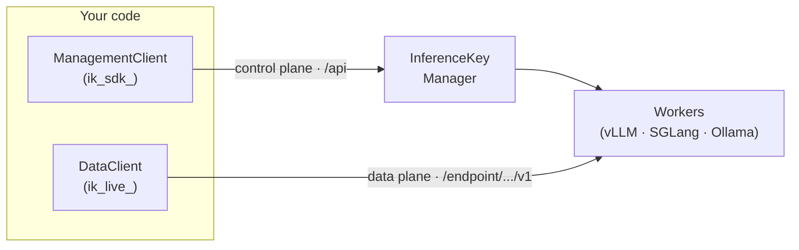

import { Tabs, TabItem, Card, CardGrid, Aside, Steps, LinkCard } from "@astrojs/starlight/components";

<CardGrid>
  <Card title="OpenAI-compatible" icon="rocket">
    Your workloads expose the OpenAI chat/embeddings API. Point existing code at them — no new client to learn.
  </Card>
  <Card title="Open source" icon="github">
    Apache-2.0. One audited Rust core, native Python &amp; TypeScript packages — read it, vendor it, trust it.
  </Card>
  <Card title="Secure by design" icon="approve-check">
    Two tokens, least privilege: a leaked inference key can never reconfigure your infrastructure.
  </Card>
</CardGrid>

## How it fits together



You **declare** a workload with the control plane (`ManagementClient`, an `ik_sdk_` token) and **call** it with the data plane (`DataClient`, an `ik_live_` token). `ensure()` is idempotent on the slug, so you can run it on every deploy.

## First result in under 5 minutes

<Steps>

1. **Get two tokens.** A control token (`ik_sdk_`) to provision and a data token (`ik_live_`) to call inference. Create both in the [dashboard](https://cloud.inferencekey.com) — see [Tokens](/quickstart/tokens/).

2. **Set your environment.**

   ```bash title=".env"
   export INFERENCEKEY_BASE_URL="https://api.inferencekey.com"
   export INFERENCEKEY_PROJECT="acme"
   export INFERENCEKEY_SDK_TOKEN="ik_sdk_..."   # control plane
   export INFERENCEKEY_API_KEY="ik_live_..."    # data plane (default)
   ```

3. **Ensure the workload, then call it.**

</Steps>

<Tabs syncKey="lang">
  <TabItem label="Python">

```python title="quickstart.py"
from inferencekey import ManagementClient, DataClient, WorkloadSpec, Backend

# Control plane: provision/reconcile the workload (ik_sdk_ token).
mgmt = ManagementClient.from_env(project="acme")
ref = mgmt.ensure(WorkloadSpec(
    name="support-bot",
    slug="support-bot",
    model="meta-llama/Llama-3.1-8B-Instruct",
    backend=Backend.VLLM,
    command="vllm serve meta-llama/Llama-3.1-8B-Instruct --max-model-len 8192",
))

# Data plane: call the resulting OpenAI-compatible endpoint (ik_live_ token).
data = DataClient.from_env(project="acme")
ep = data.endpoint(ref.workload_slug, api_key="ik_live_...")
out = ep.generate_text(prompt="Hola", temperature=0.2, max_tokens=300)

print(out.text)   # generated text
print(out.model)  # model that served the request
```

  </TabItem>
  <TabItem label="TypeScript">

```typescript title="quickstart.ts"
import { ManagementClient, DataClient, Backend } from "@inferencekey/sdk";

// Control plane: provision/reconcile the workload (ik_sdk_ token).
const mgmt = ManagementClient.fromEnv({ project: "acme" });
const ref = await mgmt.ensure({
  name: "support-bot",
  slug: "support-bot",
  model: "meta-llama/Llama-3.1-8B-Instruct",
  backend: Backend.Vllm,
  command: "vllm serve meta-llama/Llama-3.1-8B-Instruct --max-model-len 8192",
});

// Data plane: call the resulting OpenAI-compatible endpoint (ik_live_ token).
const data = DataClient.fromEnv({ project: "acme" });
const ep = data.endpoint(ref.workloadSlug, { apiKey: process.env.SUPPORT_IK_LIVE });
const out = await ep.generateText({ prompt: "Hola", temperature: 0.2, maxTokens: 300 });

console.log(out.text);  // generated text
```

  </TabItem>
</Tabs>

<Aside type="tip" title="Two tokens, least privilege">
  The `ik_sdk_` control token provisions workloads but **cannot** call inference. The `ik_live_` data token calls inference but **cannot** provision. Pass a data key per workload — one app can drive many workloads, each with its own key.
</Aside>

## Explore the docs

<CardGrid>
  <LinkCard
    title="Quickstart"
    description="Get your tokens, run your first ensure(), and make your first call."
    href="/quickstart/tokens/"
  />
  <LinkCard
    title="Guides"
    description="Authentication, workloads by policy / worker / modality, and end-to-end use cases."
    href="/guides/authentication/"
  />
  <LinkCard
    title="Reference"
    description="Architecture, tokens, OnDrift, backends and policies, wire format, and common errors."
    href="/reference/architecture/"
  />
  <LinkCard
    title="API reference"
    description="Full Python and TypeScript surface. Go and Java are coming soon (bind the C ABI)."
    href="/api/"
  />
</CardGrid>

<CardGrid stagger>
  <Card title="Declare, don't click" icon="setting">
    Describe a workload with a `WorkloadSpec`. `ensure()` reconciles the platform to match — idempotent on the explicit slug, with `OnDrift.RECONCILE` by default.
  </Card>
  <Card title="OpenAI-compatible endpoints" icon="rocket">
    Every workload is reachable under `/endpoint/:projectSlug/:workloadSlug/v1/...` — chat/completions and embeddings, with SSE streaming when you ask for it.
  </Card>
  <Card title="One core, native bindings" icon="puzzle">
    A single Rust core behind a C ABI powers the Python wheel (`inferencekey`) and the Node/TypeScript addon (`@inferencekey/sdk`). Go and Java are coming soon.
  </Card>
  <Card title="Twelve modalities" icon="open-book">
    Text, embeddings, images, audio, reranking, classification, reward and more — pick a backend (vLLM, SGLang, Ollama) and a policy (fixed, scheduled, autoscaling).
  </Card>
</CardGrid>

---

New to InferenceKey? [Create an account or open the dashboard](https://cloud.inferencekey.com) · Learn more at [inferencekey.com](https://inferencekey.com).