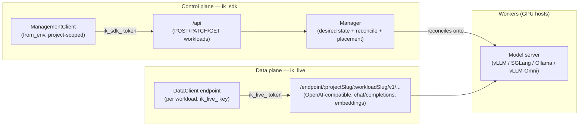
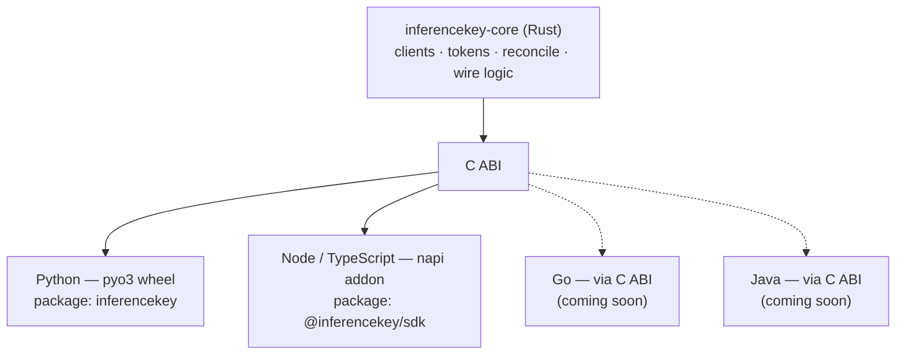

import { Tabs, TabItem, Card, CardGrid, Aside, LinkCard } from "@astrojs/starlight/components";

The InferenceKey SDK is split along one principle: **provisioning and inference never share a path, a client, or a token.** You declare workloads with one client, then call them with another. This page maps the pieces and shows how a request flows through each plane.

## Two planes

Every interaction with the platform belongs to exactly one of two planes. They use different clients, different tokens, and different HTTP surfaces.

<CardGrid>
  <Card title="Control plane" icon="setting">
    Provision and reconcile workloads. Driven by **`ManagementClient`**, scoped to a single project, talking to the Manager under **`/api`**. Cannot call inference.
  </Card>
  <Card title="Data plane" icon="rocket">
    Run inference. Driven by **`DataClient`**, which hands you a per-workload endpoint under **`/endpoint/:projectSlug/:workloadSlug/v1/...`**. Cannot provision.
  </Card>
</CardGrid>

This separation is enforced by the tokens themselves, not just by convention. A control token presented to the data plane (or vice versa) is rejected — see [Tokens](/reference/tokens/) and [Common errors](/reference/common-errors/).

## Two tokens

The SDK uses two token types so that the code which *creates* workloads is never the code that *calls* them. This is least privilege by construction.

| Token prefix | Plane | Client | Scope | Can it call inference? | Can it provision? |
| --- | --- | --- | --- | --- | --- |
| `ik_sdk_` | Control | `ManagementClient` | One project | No | Yes |
| `ik_live_` | Data | `DataClient` endpoints | Per workload | Yes | No |

- **`ik_sdk_`** is held by your management/deployment code. It provisions and reconciles workloads for one project and nothing else.
- **`ik_live_`** is passed **per workload** when you build an endpoint. One application can hold many `ik_live_` keys — one per workload — so a leaked key blasts only a single workload's radius.

<Aside type="tip" title="Resolution order">
Configuration is resolved **explicit argument &gt; environment variable &gt; file**. The control token comes from `INFERENCEKEY_SDK_TOKEN`; the default data key comes from `INFERENCEKEY_API_KEY` (an `ik_live_` value). `INFERENCEKEY_BASE_URL` and `INFERENCEKEY_PROJECT` round out the environment.
</Aside>

## The Manager / worker split

The control plane terminates at the **Manager**, the platform's brain. The Manager owns workload state and reconciliation; it decides *where* a workload runs. **Workers** are the machines (with GPUs) that actually host model servers.

- **Manager** — accepts control requests under `/api`, stores the desired workload state, and reconciles it onto workers. Placement is the platform's job: your `WorkloadSpec` has **no `provider` and no `min_vram_gb`** — you describe *what* you want, not *which box* it lands on.
- **Workers** — run the model server for a workload (vLLM, SGLang, Ollama, …) and expose the OpenAI-compatible surface that the data plane reaches under `/endpoint`.

When you call `ensure()`, the Manager creates or updates the workload and returns a reference. Idempotency is keyed on the **explicit `slug`** you provide, so re-running the same `ensure()` converges instead of duplicating. Drift between your spec and the live workload is handled by the `on_drift` policy, which defaults to `OnDrift.RECONCILE` — see [OnDrift](/reference/ondrift/).

```python title="control plane: declare a workload"
from inferencekey import ManagementClient, WorkloadSpec, Backend

mgmt = ManagementClient.from_env(project="acme")   # reads INFERENCEKEY_SDK_TOKEN
ref = mgmt.ensure(WorkloadSpec(
    name="support-bot",
    slug="support-bot",
    model="meta-llama/Llama-3.1-8B-Instruct",
    backend=Backend.VLLM,
    command="vllm serve meta-llama/Llama-3.1-8B-Instruct --max-model-len 8192",
))
# ref.project_slug / ref.workload_slug identify the live workload
```

Under the hood that call is one of the control routes:

- `POST /api/projects/:project_id/workloads` — create
- `PATCH /api/workloads/:id` — update
- `GET` (list) — enumerate workloads

## How a request flows

The two planes never cross. Control requests go `ManagementClient → /api → Manager → workers`. Data requests go `DataClient endpoint → /endpoint/.../v1 → worker`.



Notice the Manager *reconciles onto* workers (control), while data requests reach the **same** worker directly through `/endpoint` — but with a different token and a different URL. Neither plane can do the other's job.

```python title="data plane: call the workload"
from inferencekey import DataClient

data = DataClient.from_env(project="acme")
ep = data.endpoint(ref.workload_slug, api_key="ik_live_...")
out = ep.generate_text(prompt="Hola", temperature=0.2, max_tokens=300)
print(out.text, out.model)
```

The data plane is **OpenAI-compatible**: text generation maps to `chat/completions`, embeddings to `embeddings`. When you request streaming the response is Server-Sent Events terminated by `data: [DONE]`. See [Wire format](/reference/wire-format/) for the exact shapes.

## One Rust core, many bindings

There is a single implementation of the SDK — a Rust core (`inferencekey-core`) — exposed to each language through a thin native binding. The control/data semantics, token handling, idempotency, and HTTP wire logic live in the core, so every language behaves identically.



<CardGrid>
  <Card title="Python — shipping" icon="seti:python">
    pyo3 wheel, installed as **`inferencekey`**. `from inferencekey import ManagementClient, DataClient, WorkloadSpec, Backend, OnDrift`.
  </Card>
  <Card title="Node / TypeScript — shipping" icon="seti:typescript">
    napi addon, installed as **`@inferencekey/sdk`**. `import { ManagementClient, DataClient, Backend, OnDrift } from "@inferencekey/sdk"`. Methods are async (Promises).
  </Card>
  <Card title="Go — coming soon" icon="seti:go">
    Binds the C ABI directly.
  </Card>
  <Card title="Java — coming soon" icon="seti:java">
    Binds the C ABI directly.
  </Card>
</CardGrid>

Because both shipping languages wrap the same core, the only differences are idiomatic: naming (`from_env` vs `fromEnv`, `WorkloadSpec` fields vs an object literal, the `Backend.VLLM` vs `Backend.Vllm` enum casing) and the async surface in Node.

<Tabs syncKey="lang">
  <TabItem label="Python">
```python
from inferencekey import ManagementClient, DataClient, WorkloadSpec, Backend

mgmt = ManagementClient.from_env(project="acme")
ref = mgmt.ensure(WorkloadSpec(
    name="support-bot",
    slug="support-bot",
    model="meta-llama/Llama-3.1-8B-Instruct",
    backend=Backend.VLLM,
    command="vllm serve meta-llama/Llama-3.1-8B-Instruct --max-model-len 8192",
))

data = DataClient.from_env(project="acme")
ep = data.endpoint(ref.workload_slug, api_key="ik_live_...")
out = ep.generate_text(prompt="Hola", temperature=0.2, max_tokens=300)
print(out.text)
```
  </TabItem>
  <TabItem label="TypeScript">
```typescript
import { ManagementClient, DataClient, Backend } from "@inferencekey/sdk";

const mgmt = ManagementClient.fromEnv({ project: "acme" });
const ref = await mgmt.ensure({
  name: "support-bot",
  slug: "support-bot",
  model: "meta-llama/Llama-3.1-8B-Instruct",
  backend: Backend.Vllm,
  command: "vllm serve meta-llama/Llama-3.1-8B-Instruct --max-model-len 8192",
});

const data = DataClient.fromEnv({ project: "acme" });
const ep = data.endpoint(ref.workloadSlug, { apiKey: process.env.SUPPORT_IK_LIVE });
const out = await ep.generateText({ prompt: "Hola", temperature: 0.2, maxTokens: 300 });
console.log(out.text);
```
  </TabItem>
</Tabs>

## What the platform owns vs. what you declare

The split also defines responsibility. You declare *intent*; the platform handles *placement and lifecycle*.

- **You declare** the `WorkloadSpec`: `name`, `slug`, `model`, `backend`, and optionally `command`, `vllm_version`, `task_type`, `execution_policy` (`fixed` | `scheduled` | `autoscaling`), and friends. There is **no `provider`** and **no `min_vram_gb`**.
- **The platform decides** which worker hosts the workload, when it scales, and how reconciliation runs. Backends are `ollama`, `vllm`, `vllm-omni`, and `sglang`; `task_type` defaults to `text2text` and covers 12 modalities (some, like `reranker` / `classification` / `reward`, are async-only). Details in [Backends and policies](/reference/backends-and-policies/).

## Where to go next

<CardGrid>
  <LinkCard title="Tokens" href="/reference/tokens/" description="The two token types, scopes, and how each plane enforces them." />
  <LinkCard title="OnDrift" href="/reference/ondrift/" description="How ensure() reconciles your spec against the live workload." />
  <LinkCard title="Wire format" href="/reference/wire-format/" description="Control routes and the OpenAI-compatible data surface, including SSE streaming." />
  <LinkCard title="Common errors" href="/reference/common-errors/" description="403 wrong_credential_type, project_scope_mismatch, scope_insufficient, and the rest." />
</CardGrid>

---

New to InferenceKey? [Create an account or open the dashboard](https://cloud.inferencekey.com) · Learn more at [inferencekey.com](https://inferencekey.com).